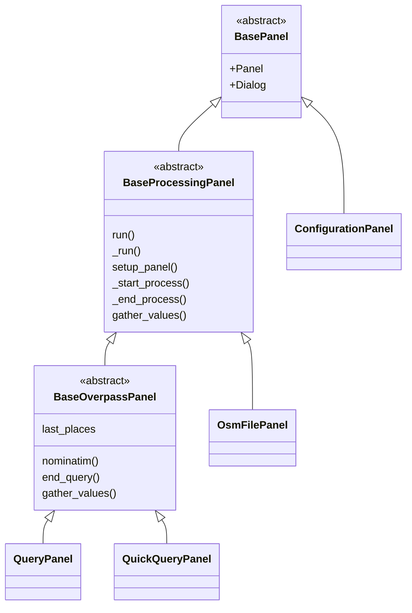

---
hide:
  - navigation
---

<!--
The file CONTRIBUTING.md is copied by the CI before building the doc in this directory
On your local, make a symlink with ln -s
-->

--8<-- "./CONTRIBUTING.md"

## Architecture

