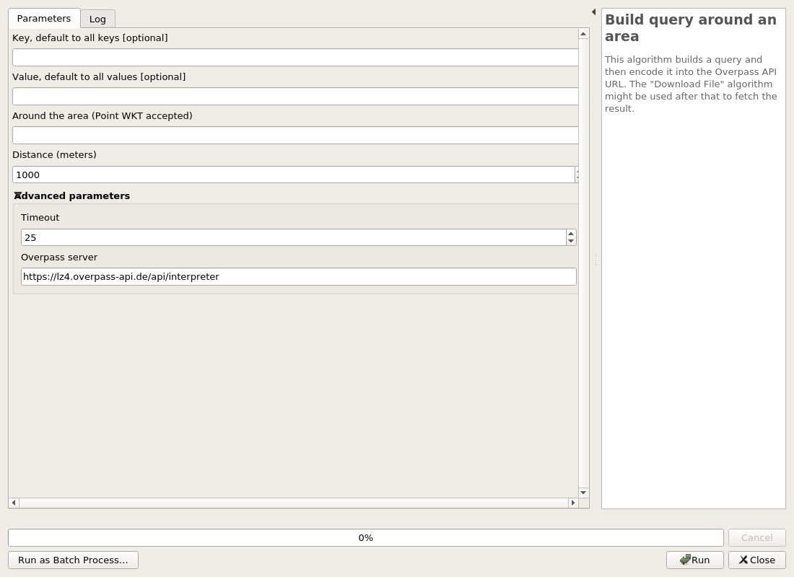
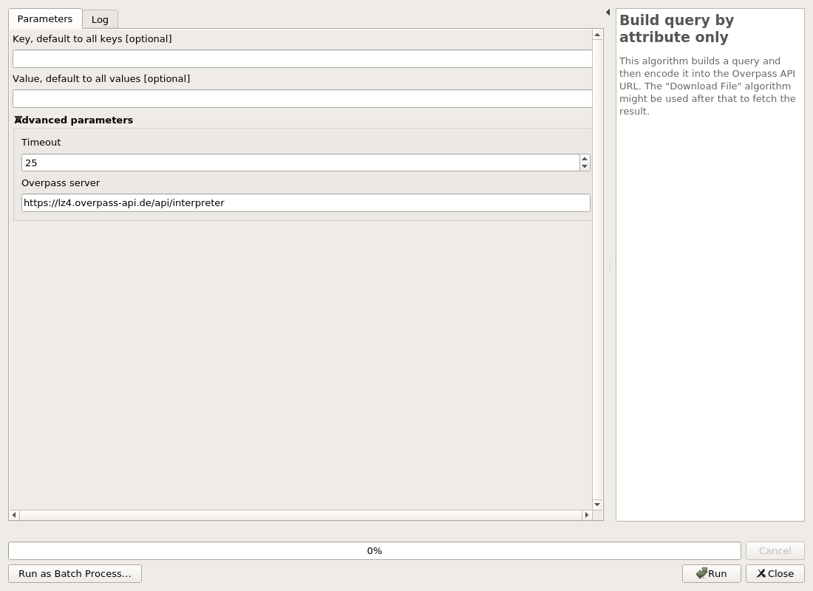

---
hide:
  - navigation
---

# Processing

## Advanced

### Build query around an area

This algorithm builds a query and then encode it into the Overpass API URL. The "Download File" algorithm might be used after that to fetch the result.

#### Parameters

| ID | Description | Type | Info | Required | Advanced | Option |
|:-:|:-:|:-:|:-:|:-:|:-:|:-:|
KEY|Key, default to all keys|String|The OSM key to use. It can be empty and it will default to all keys.||||
VALUE|Value, default to all values|String|The OSM value to use. It can be empty and it will default to all values.||||
AREA|Around the area|String|The name of a place, a first query to the Nominatim API will be executed to fetch the OSM ID. A WKT Point string is accepted as well.|✓|||
DISTANCE|Distance (meters)|Number|The distance to use when doing the buffering around the named area. The distance must be in meters.|✓||Default: 1000   Type: Integer  Min: 1.0, Max: 1.7976931348623157e+308  |
TIMEOUT|Timeout|Number|The timeout to use for the Overpass API.|✓|✓|Default: 25   Type: Integer  Min: 5.0, Max: 1.7976931348623157e+308  |
SERVER|Overpass server|String|The Overpass API server to use to build the encoded URL.|✓|✓|Default: https://lz4.overpass-api.de/api/interpreter   |

#### Outputs

| ID | Description | Type | Info |
|:-:|:-:|:-:|:-:|
OUTPUT_URL|Query as encoded URL|String|The query is generated and encoded with the Overpass API URL. This output should be used in the File Downloader algorithm.|
OUTPUT_OQL_QUERY|Raw query as OQL|String|The query is generated in the OQL format.|

***

### Build query by attribute only

This algorithm builds a query and then encode it into the Overpass API URL. The "Download File" algorithm might be used after that to fetch the result.

#### Parameters

| ID | Description | Type | Info | Required | Advanced | Option |
|:-:|:-:|:-:|:-:|:-:|:-:|:-:|
KEY|Key, default to all keys|String|The OSM key to use. It can be empty and it will default to all keys.||||
VALUE|Value, default to all values|String|The OSM value to use. It can be empty and it will default to all values.||||
TIMEOUT|Timeout|Number|The timeout to use for the Overpass API.|✓|✓|Default: 25   Type: Integer  Min: 5.0, Max: 1.7976931348623157e+308  |
SERVER|Overpass server|String|The Overpass API server to use to build the encoded URL.|✓|✓|Default: https://lz4.overpass-api.de/api/interpreter   |

#### Outputs

| ID | Description | Type | Info |
|:-:|:-:|:-:|:-:|
OUTPUT_URL|Query as encoded URL|String|The query is generated and encoded with the Overpass API URL. This output should be used in the File Downloader algorithm.|
OUTPUT_OQL_QUERY|Raw query as OQL|String|The query is generated in the OQL format.|

***

### Build query inside an extent

This algorithm builds a query and then encode it into the Overpass API URL. The "Download File" algorithm might be used after that to fetch the result.

#### Parameters

| ID | Description | Type | Info | Required | Advanced | Option |
|:-:|:-:|:-:|:-:|:-:|:-:|:-:|
KEY|Key, default to all keys|String|The OSM key to use. It can be empty and it will default to all keys.||||
VALUE|Value, default to all values|String|The OSM value to use. It can be empty and it will default to all values.||||
EXTENT|Extent|Extent|The extent as a rectangle to use when building the query.|✓|||
TIMEOUT|Timeout|Number|The timeout to use for the Overpass API.|✓|✓|Default: 25   Type: Integer  Min: 5.0, Max: 1.7976931348623157e+308  |
SERVER|Overpass server|String|The Overpass API server to use to build the encoded URL.|✓|✓|Default: https://lz4.overpass-api.de/api/interpreter   |

#### Outputs

| ID | Description | Type | Info |
|:-:|:-:|:-:|:-:|
OUTPUT_URL|Query as encoded URL|String|The query is generated and encoded with the Overpass API URL. This output should be used in the File Downloader algorithm.|
OUTPUT_OQL_QUERY|Raw query as OQL|String|The query is generated in the OQL format.|

***

### Build query inside an area

This algorithm builds a query and then encode it into the Overpass API URL. The "Download File" algorithm might be used after that to fetch the result.

#### Parameters

| ID | Description | Type | Info | Required | Advanced | Option |
|:-:|:-:|:-:|:-:|:-:|:-:|:-:|
KEY|Key, default to all keys|String|The OSM key to use. It can be empty and it will default to all keys.||||
VALUE|Value, default to all values|String|The OSM value to use. It can be empty and it will default to all values.||||
AREA|Inside the area|String|The name of the area. This will make a first query to the Nominatim API to fetch the OSM ID.|✓|||
TIMEOUT|Timeout|Number|The timeout to use for the Overpass API.|✓|✓|Default: 25   Type: Integer  Min: 5.0, Max: 1.7976931348623157e+308  |
SERVER|Overpass server|String|The Overpass API server to use to build the encoded URL.|✓|✓|Default: https://lz4.overpass-api.de/api/interpreter   |

#### Outputs

| ID | Description | Type | Info |
|:-:|:-:|:-:|:-:|
OUTPUT_URL|Query as encoded URL|String|The query is generated and encoded with the Overpass API URL. This output should be used in the File Downloader algorithm.|
OUTPUT_OQL_QUERY|Raw query as OQL|String|The query is generated in the OQL format.|

***

### Build raw query

A XML or OQL query to send to a Overpass API server.

#### Parameters

| ID | Description | Type | Info | Required | Advanced | Option |
|:-:|:-:|:-:|:-:|:-:|:-:|:-:|
QUERY|Query|String|A XML or OQL query to be send to the Overpass API. It can contains some {{}} tokens.|✓|||
EXTENT|Extent, if "{{bbox}}" in the query|Extent|If the query has a {{bbox}} token, this extent will be used for replacement.||||
SERVER|Overpass server|String|The Overpass API server to use to build the encoded URL.|✓|✓|Default: https://lz4.overpass-api.de/api/interpreter   |
AREA|Area (if you want to override {{geocodeArea}} in the query)|String|The query is generated in the OQL format.||✓||

#### Outputs

| ID | Description | Type | Info |
|:-:|:-:|:-:|:-:|
OUTPUT_URL|Query as encoded URL|String||
OUTPUT_OQL_QUERY|Raw query as OQL|String||

***

### Open sublayers from an OSM file

Open all sublayers from an OSM file. A custom OSM configuration file can be specified following the OGR documentation. This algorithm will not make a copy of the input file, it will only open it using OGR and custom INI file if provided.

#### Parameters

| ID | Description | Type | Info | Required | Advanced | Option |
|:-:|:-:|:-:|:-:|:-:|:-:|:-:|
FILE|OSM file|File|The extension can be a OSM or PBF file.|✓|||
OSM_CONF|OSM configuration|File|The OGR OSM configuration file. This file is used to customize the import process about OSM tags. You should read the OGR documentation https://gdal.org/drivers/vector/osm.html||||

#### Outputs

| ID | Description | Type | Info |
|:-:|:-:|:-:|:-:|
OUTPUT_POINTS|Output points|VectorLayer|The point layer from the OGR OSM driver.|
OUTPUT_LINES|Output lines|VectorLayer|The line layer from the OGR OSM driver.|
OUTPUT_MULTILINESTRINGS|Output multilinestrings|VectorLayer|The multilinestrings layer from the OGR OSM driver.|
OUTPUT_MULTIPOLYGONS|Output multipolygons|VectorLayer|The multipolygon layer from the OGR OSM driver.|
OUTPUT_OTHER_RELATIONS|Output other relations|VectorLayer|The relation layer from the OGR OSM driver.|

***

