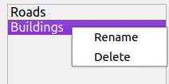

# Map presets

A *Map preset* in QuickOSM is composed of :

* a name
* a description
* one or many queries :
    * either QuickQuery
    * or raw Overpass query
* one or many GIS layer
* one or many QGIS QML style related to these layers
* a thumbnail as PNG or JPG to show a display of this map preset

## Create or update a map preset

To create a new map preset, you must start from the "Quick query" panel, scroll to the bottom.
Then you have two options : 

* create a new map preset
* add query to an existing map preset

## General parameters

You can set a :

* name
* description
* basic or advanced

With **basic**, you will have the QuickQuery panel. With this kind of query, the extent or the named area can be changed
on run-time.

With **advanced**, it's a raw Overpass query. The query is designed either to run with `{{bbox}}` or ` {{geocodeArea:}}`.

## List of queries

In the map preset editor, you can find the list of queries included in this map preset.

!!! tip
    You can rename or delete a query by right-clicking in the list.

    

## Editing a query

Depending on the kind of query, you either find the Quick Query table or the Overpass text editor.

### Associate a style with a query

When editing a **query** within a **map preset**, you can click the QML help button.
It will give you the list of QML file you can add in the folder for the selected *query*.
